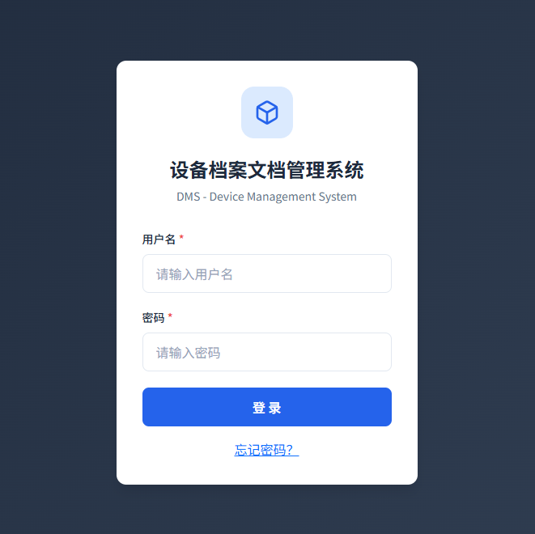
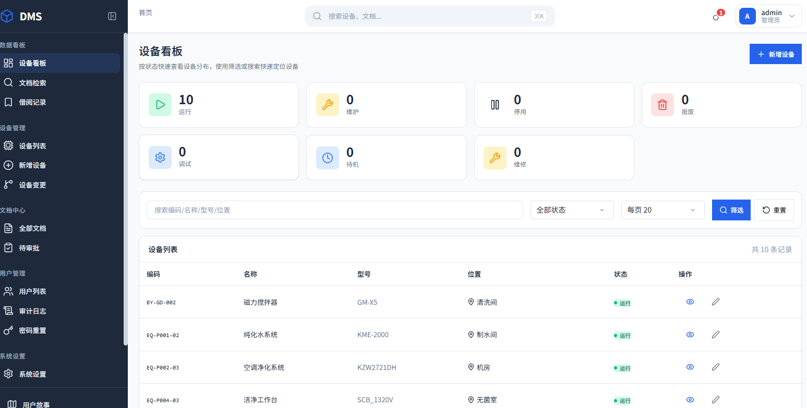
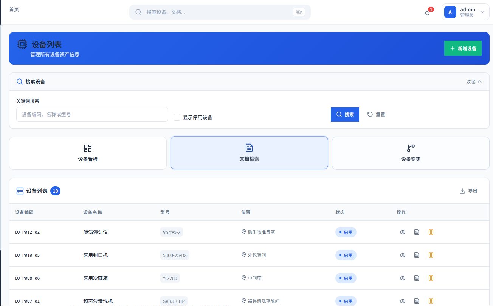
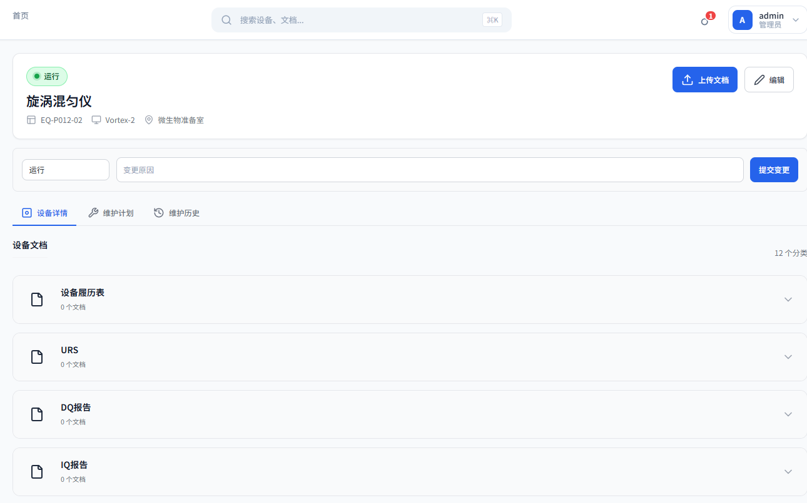
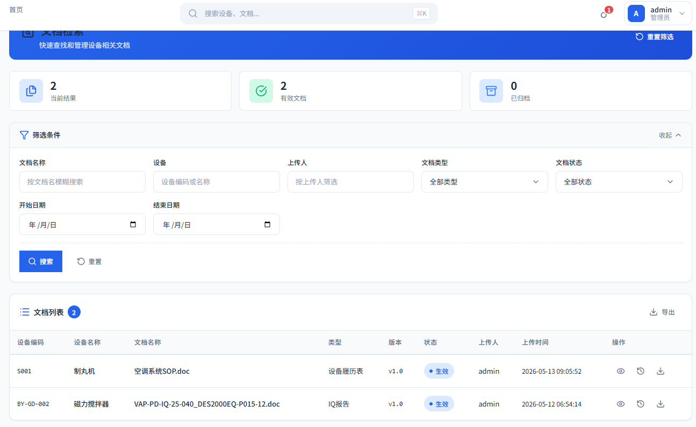
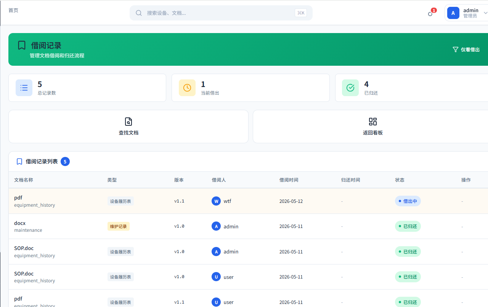
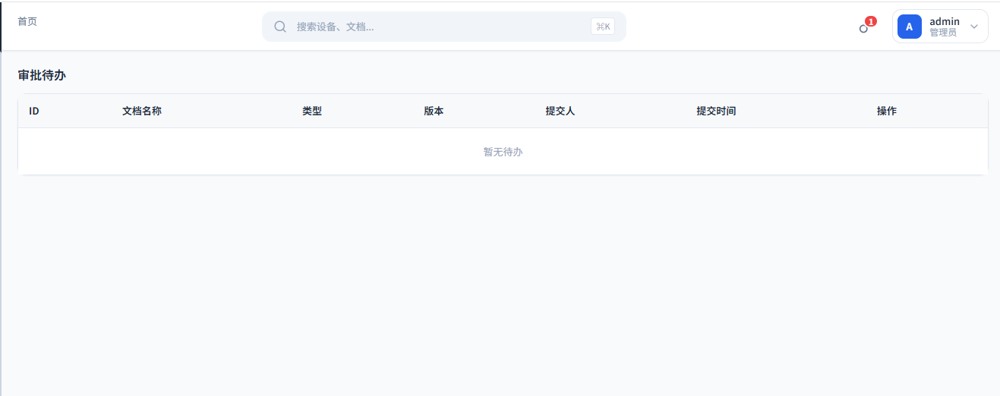
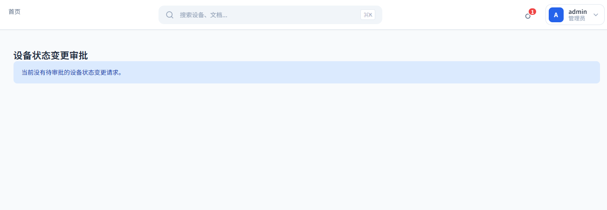
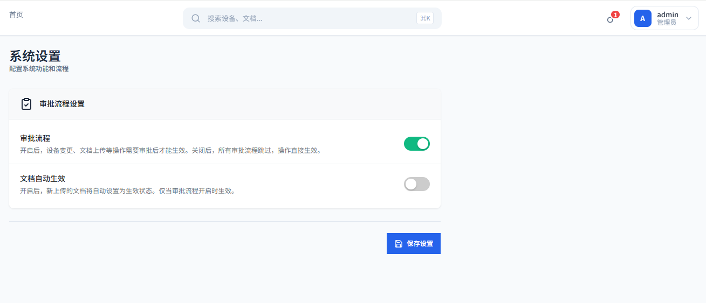

# 设备档案文档管理系统 (DMS)

<div align="center">


**轻量级设备档案与文档管理系统 | 开箱即用 | 支持自动化部署**

[功能介绍](#功能介绍) • [快速开始](#快速开始) • [系统截图](#系统截图) • [部署指南](#部署指南) • [项目结构](#项目结构)

</div>

---

## 功能介绍

### 📋 核心功能

| 模块 | 功能 | 说明 |
|------|------|------|
| **设备管理** | 新增/编辑/停用/报废 | 完整的设备生命周期管理 |
| **设备看板** | 状态统计与列表 | 可视化设备分布情况 |
| **设备校准** | 校准计划与记录 | 确保设备精度合规 |
| **设备维护** | 维护计划与执行 | 预防性维护管理 |
| **文档中心** | 上传/下载/版本控制 | 支持多版本文档管理 |
| **借阅管理** | 借出/归还/审批 | 文档资产追踪 |
| **审批流程** | 多级审批+电子签名 | 数字化审批体验 |
| **提醒中心** | 待办事项与通知 | 不遗漏任何事项 |

### 🔐 权限系统

系统内置 **7 种角色**，精细化权限控制：

```
┌─────────────────────────────────────────────────────────────┐
│                        角色权限矩阵                          │
├──────────┬────────┬────────┬────────┬────────┬────────┬──────┤
│ 管理员   │ 设备工程师│ 文档管理员 │ 质量工程师│ 部门经理│ 主管 │访客│
├──────────┼────────┼────────┼────────┼────────┼────────┼──────┤
│    ✅    │   ✅   │   ✅   │   ✅   │   ✅   │   ✅   │  ❌  │
└──────────┴────────┴────────┴────────┴────────┴────────┴──────┘
```

### 📊 审计追踪

所有关键操作均记录审计日志，便于：
- 合规审查
- 问题追溯
- 操作统计

---

## 快速开始

### 环境要求

- Python 3.10+
- SQLite（默认）或 MySQL（可选）

### 安装步骤

```bash
# 1. 克隆项目
git clone https://github.com/YOUR_USERNAME/EquipmentManagement.git
cd EquipmentManagement

# 2. 安装依赖
pip install -r requirements.txt

# 3. 启动服务
python app.py
```

### 访问系统

> 🌐 **http://127.0.0.1:5000**

### 默认账号

| 角色 | 用户名 | 密码 |
|------|--------|------|
| 管理员 | admin | admin123 |
| 设备工程师 | user | user123 |

> ⚠️ **请首次登录后立即修改默认密码！**

---

## 系统截图

### 登录页面


### 设备看板


### 设备列表


### 设备详情


### 文档中心


### 借阅管理


### 审批流程


### 提醒中心


### 系统设置


---

## 部署指南

### 本地开发部署

```bash
# 使用虚拟环境
python -m venv .venv
source .venv/bin/activate  # Linux/Mac
.venv\Scripts\activate     # Windows

# 安装依赖
pip install -r requirements.txt

# 启动服务
python app.py

# 实时查看应用日志
tail -f /data/EquipmentManagement/logs/app.log

# 查看错误日志
tail -f /data/EquipmentManagement/logs/error.log

# 搜索错误
grep -i "error\|exception" /data/EquipmentManagement/logs/app.log

```

### Linux 服务器部署

```bash
# 安装依赖
pip3 install flask gunicorn

# gunicorn 启动
pkill -f gunicorn
nohup gunicorn --bind 0.0.0.0:5000 --workers 2 app:app > gunicorn.log 2>&1 &
tail -f gunicorn.log

# 使用 systemd 管理服务
sudo cp deploy/*.service /etc/systemd/system/
sudo systemctl enable dms
sudo systemctl start dms
sudo systemctl status dms-webhook
```

### 一键迁移

新服务器快速部署：

```bash
curl -sL https://raw.githubusercontent.com/YOUR_USERNAME/EquipmentManagement/main/migrate/quick_migrate.sh | bash
```

---

## 自动化部署

本项目支持 **GitHub Webhook** 自动化部署。

### 配置步骤

1. GitHub 仓库 → Settings → Webhooks → Add webhook
2. 配置：
   - **Payload URL**: `http://YOUR_SERVER:5001/webhook`
   - **Content type**: `application/json`
   - **Secret**: `YOUR_WEBHOOK_SECRET`
   - **Events**: `push`

### 部署流程

```
Git Push → GitHub Webhook → 服务器自动拉取 → 重启服务
```

### 查看日志

```bash
# 实时查看部署日志
tail -f /var/log/webhook-deploy.log
```

---

## 项目结构

```
EquipmentManagement/
├── app.py                 # 应用入口
├── config.py              # 配置文件
├── database.py            # 数据库模型
├── requirements.txt       # Python 依赖
│
├── blueprints/            # 路由模块
│   ├── auth.py           # 认证模块
│   ├── devices.py        # 设备管理
│   ├── documents.py      # 文档管理
│   ├── borrowing.py      # 借阅管理
│   └── ...
│
├── models/                # 数据模型
│   ├── device.py
│   ├── document.py
│   ├── borrowing.py
│   └── ...
│
├── templates/             # 前端模板
│   ├── base.html
│   ├── login.html
│   └── ...
│
├── static/                # 静态资源
│   ├── css/
│   ├── js/
│   └── uploads/          # 上传文件
│
├── scripts/               # 脚本工具
│   ├── webhook_server.py  # Webhook 服务
│   └── ...
│
├── migrate/               # 迁移脚本
│   ├── quick_migrate.sh
│   └── ...
│
├── docs/                  # 文档
│   ├── 使用手册.md
│   └── screenshots/      # 截图目录
│
└── tests/                 # 测试文件
```

---

## 数据库配置

### 默认 SQLite（开箱即用）

无需任何配置，直接启动即可。

### 可选 MySQL

```bash
# 1. 安装依赖
pip install pymysql cryptography

# 2. 修改 database.py 中的连接配置
```
服务器上部署时，把 .env.example 复制为 .env，再填上服务器的真实配置即可
---

## 常见问题

| 问题 | 解决方案 |
|------|----------|
| 登录后看不到内容 | 检查账号是否被停用或权限分配 |
| 上传失败 | 确认文件类型（pdf/doc/docx/xls/xlsx/jpg/png） |
| 服务启动失败 | 检查端口占用 `lsof -i:5000` |
| 数据库异常 | 删除 `dms.db` 重启自动重建 |

---

## 参考文档

- 📖 [使用手册](docs/使用手册.md)

---

## 开源协议

MIT License

---

<div align="center">

**如果这个项目对你有帮助，请点个 ⭐ Star！**

</div>
